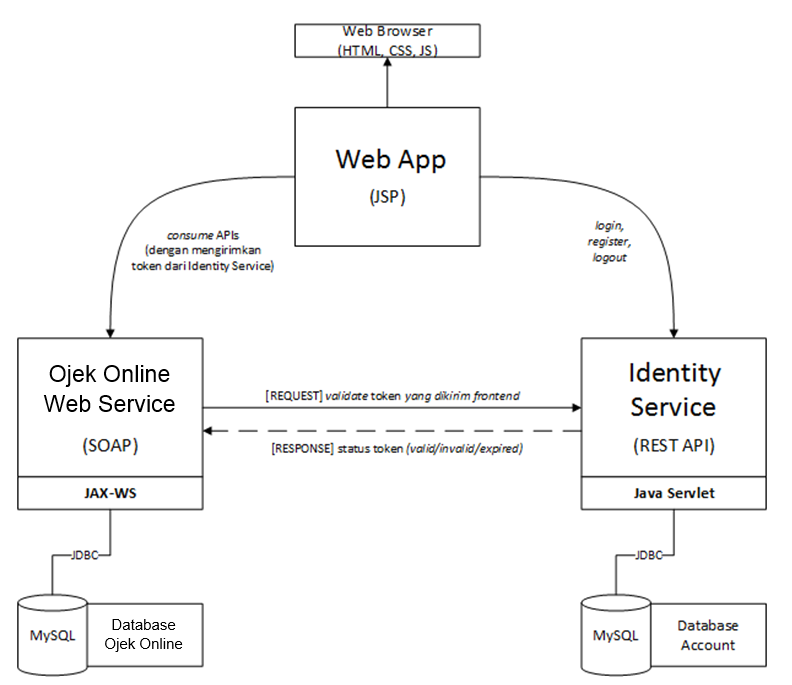

# Tugas 2 IF3110 Pengembangan Aplikasi Berbasis Web

## Anggota Tim
    1. Hisham Lazuardi Yusuf - 13515069
    2. Paskahlis Anjas Prabowo - 13515108
    3. Zacki Zulfikar Fauzi - 13515147

## Arsitektur Umum Server

## Penjelasan

### Basis data dari sistem.
#### Basis Data Identitas
##### Tabel Account

| username | email | password |
| -------- | ----- | -------- |
|          |       |          |

##### Tabel Auth

| username | token | expirytime |
| -------- | ----- | ---------- |
|          |       |            |

#### Basis Data Ojek Online

##### Tabel Customer

| username | email | name | phone_number |
| -------- | ----- | ---- | ------------ |
|          |       |      |              |

##### Tabel Driver

| username | is_active | preferred_location |
| -------- | --------- | ------------------ |
|          |           |                    |

##### Tabel Pesanan

| user_customer | user_driver | origin | destination | date | rating | comment | is_hidden_customer | is_hidden_driver |
| ------------- | ----------- | ------ | ----------- | ---- | ------ | ------- | ------------------ | ---------------- |
|               |             |        |             |      |        |               |                    |                  |
## Konsep *shared session* dengan menggunakan REST.
Pengguna akan mendapatkan token setiap melakukan login maupun register. Token dibangkitkan oleh Identity Service. Identity Service akan mengirimkan token dan expiry time yang dibangitkan ke Web App untuk kepeluan validasi terhadap setiap request yang dilakukan pengguna ke Web Service. <i>Request</i> yang diajukan oleh pengguna akan dianggap tidak valid jika dilakukan setelah masa berlaku tokennya habis.
## Pembangkitan token dan expire time pada sistem.
Pada Identity Service, terdapat kelas random generator yang digunakan untuk membangkitkan token setiap ada pengguna yang melakukan login atau register. Panjang token yang dibangkitkan adalah 10 karakter. Setiap token yang dibangkitkan memiliki expiry time selama 10 menit. Token dan expiry time yang dibangkitkan disimpan dalam basis data yang terhubung dengan Identity Service. Setiap request yang dilakukan pengguna akan divalidasi terhadap token dan expiry time yang sudah disimpan sebelumnya (saat pengguna login/register).
## Kelebihan dan kelemahan dari arsitektur aplikasi tugas ini, dibandingkan dengan aplikasi monolitik (login, CRUD DB, dll jadi dalam satu aplikasi)
### Kelebihan
    - Akan lebih aman karena pada setiap akses page akan dilakukan validasi token
    - Masing-masing komponen merupakan entitas yang independen sehingga aplikasi dapat dikembangkan secara lebih fleksibel
    
### Kekurangan
    - Lebih lambat dibandingkan aplikasi monolitik
    - Pemisahan database yang dapat menimbulkan risiko baru
    - Proses pengerjaan yang lebih lama karena kompleksitasnya relatif lebih tinggi

### Pembagian Tugas

REST :
1. Login Servlet : 13515069
2. Logout Servlet : 13515108
3. Register Servlet : 13515069
4. User Servlet : 13515069
5. Validate Servlet : 13515147

SOAP :
1. Search Customer Name : 13515147
2. Validate : 13515108
3. Retrieve Driver : 13515108
4. Retrieve Driver Rating : 13515108
5. Save Order : 13515108
6. Retrieve Profile Data : 13515069
7. Search History : 13515147
8. Update Tabel : 13515147
9. Update Location : 13515069

Web app (JSP) :
1. Halaman Login : 13515069
2. Halaman Register : 13515069
3. Halaman Select Destination : 13515108
4. Halaman History Customer: 13515147
5. Halaman Profile : 13515069
6. Halaman Edit Profile : 13515147
7. Halaman Edit Preferred Location: 13515069
8. Halaman History Driver: 13515147
9. Halaman Select Driver : 13515108
10. Halaman Complete Order : 13515108
